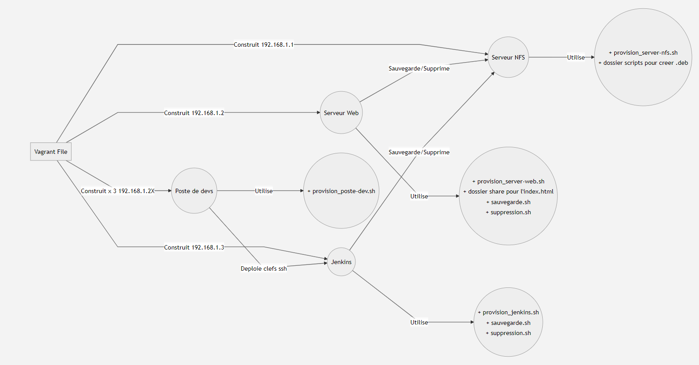

# Readme

# Prerequis 

Il faut etre sur un reseau 192.168.1/24

## Lancement

Il faut lancer la commande 

```
    vagrant up
```

Et attendre...  Cela va construire toutes les VM du tp à la suite. 
Ci dessous le schéma des interactions entre les différentes VM et les différents fichiers/dossiers.



## Serveur NFS 

Utilise le script "provision_server-nfs.sh" et aura pour ip 192.168.1.1
Il contient dans son script de provision le __packaging (tp.deb)__ des scripts rm et restore.

Il connait cependant quelques soucis il faudra tester les scripts "a la main" dans une vm vierge.


## Serveur Web

Utilise le script "provision_server-web.sh" et aura pour ip 192.168.1.2

Il va ouvrir les ports demandés et la page déployée sera accessible à l'adresse http://192.168.1.2:80

## Jenkins

Utilise le script "provision_jenkins.sh" et aura pour ip 192.168.1.3

Il va ouvrir les ports demandés, installer jenkins et terminer son installation en affichant le mot de passe par defaut de jenkins

Il sera accessible à l'adresse 192.168.1.3:8080

Lancez la commande pour vous connecter a jenkins: 
```
vagrant ssh jenkins
```
Puis tapez la commande: 
```
sudo cat /var/lib/jenkins/secrets/initialAdminPassword
```
Utilisez la clef qui apparait pour vous connecter à http://192.168.1.3:8080

Enfin tapez:
```
sudo cat /home/userjob/.ssh/authorized_keys
```
Cela va vous faire apparaitre les clefs publiques des postes dev qui ont été ajoutées.

## Poste de devs

Utilise le script "provision_poste-dev.sh" et auront des ip allant de 192.168.1.21 à 192.168.1.23.

Lors de la provision chaque poste dev va générer une clé ssh qui sera déposée sur Jenkins et va éxécuter la commande python demandée.

lancez la commande pour vous connecter a un poste dev: 
```
vagrant ssh poste_dev_3
```
puis tapez la commande: 
```
python3 example-python/vagrant/main.py
```