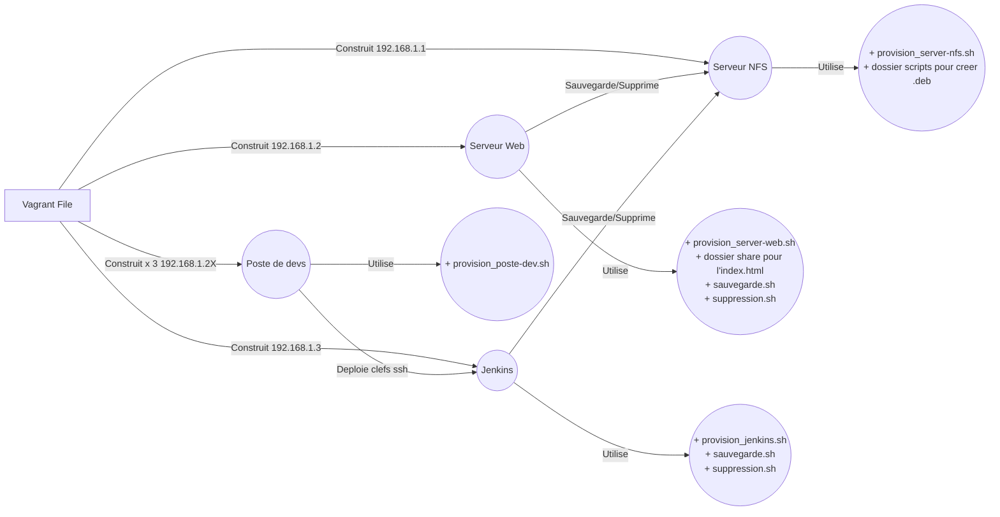

# Readme

Il faut lancer la commande 

```
    vagrant up
```

Et attendre...  Cela va construire toutes les VM du tp à la suite. 
Ci dessous le schéma des interactions entre les différentes VM et les différents fichiers/dossiers.

## Serveur NFS 

    Utilise le script "provision_server-nfs.sh" et aura pour ip 192.168.1.1
    Il contient dans son script de provision le **packaging (tp.deb)** des scripts rm et restore.
    
    Il connait cependant quelques soucis il faudra tester les scripts "a la main" dans une vm vierge.


## Serveur Web

    Utilise le script "provision_jenkins.sh" et aura pour ip 192.168.1.2

## Jenkins

    Utilise le script "provision_jenkins.sh" et aura pour ip 192.168.1.3
    
    Il va ouvrir les ports demandés, installer jenkins et terminer son installation en affichant le mot de passe par defaut de jenkins

## Poste de devs

    Utilise le script "provision_poste-dev.sh" et auront des ip allant de 192.168.1.21 à 192.168.1.23.
    
    Lors de la provision chaque poste dev va générer une clé ssh qui sera déposée sur Jenkins et va éxécuter la commande python demandée.


